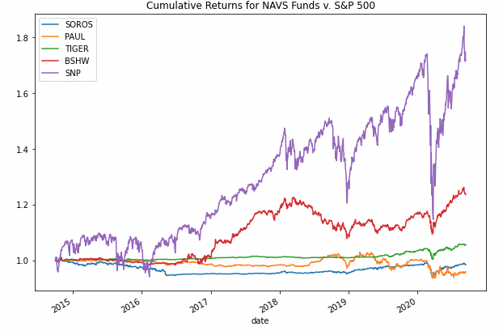
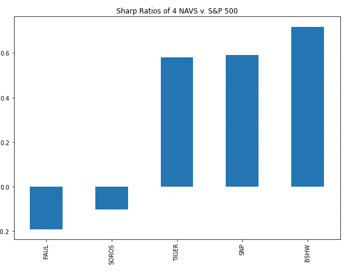
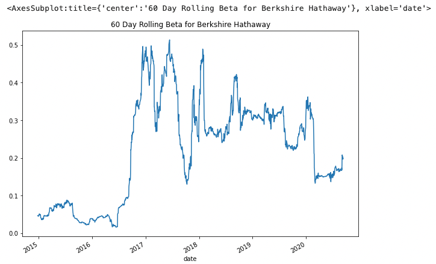
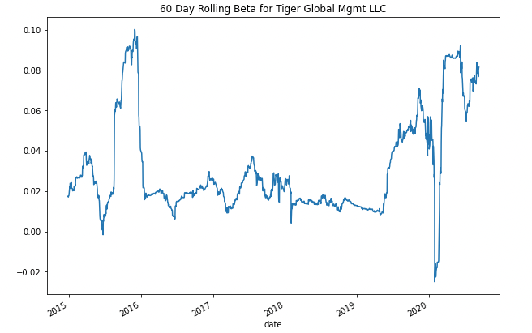

# Stock_Qual_Analysis
This project showcases the steps in quantitative analysis of investment funds to evaluate their suitablity in a diverse portfolio.

Four investment funds are identified and analysed against the S&P 500 to determine risk vs. return.  Metrics such as daily returns, standard deviation, Sharpe ration and beta are used in the risk analysis, as well as rolling statistics to to assess these funds over time.

*This project can be used to calculate the daily profit to be made when arbitrage is highand one acts quickly, vs waiting until many others take advantage of the opportunity first causing the arbitrage spread to narrow near 0.*

---

## Technologies

This Project is built to run in Jupyter Lab:

 Python 3.7 for coding
 
 Pandas for data analysis
 
 pathlib for importing and reading csv data files
 
 numpy for mathmatical functions

---

## Data Collection

***A .csv file with NAV pricing from four major funds and the S&P 500 are used in this project. The files are located in the Resources folder.***

1. **The data for this analysis was pulled using the pathlib library from a .csv file, converted by pandas to a dataframe and indexed to the date-time format. Data encompases dates from 2014-2020.
    
   `navs_df = pd.read_csv(Path("./Resources/whale_navs.csv"), index_col="date", parse_dates=True, infer_datetime_format=True)`

2. **Pandas `.pct_change()` and `.dropna()` functions were used to find the daily returns data and drop all the null values**

    `navs_daily_returns = navs_df.pct_change().dropna()`

3. **Funds were renamed with acronyms for simplifying code**
    

---

## Data Analysis for Performance

1. **Daily returns data was plotted and used to get a visual of the data layout**

`navs_daily_returns.plot(figsize=(10,5), title="Daily Returns NAVS v. S&P 500"`

    - `.cumprod()` function was utilitzed and the return was plotted to give a focused look at the cumulative returns over time
    
 

    
## Data Analysis for Volitility

1. **Daily returns were retooled into a box plot to allow easy identification of the volitility via return data spread**

`navs_4_daily_returns = navs_daily_returns.drop("SNP", axis=1)`

## Data Analysis for Risk
1. **Daily returns were again used to find the daily and anualized standard deviation**

`navs_4_std_deviation = navs_4_daily_returns.std().sort_values()`

`navs_annualized_std = (navs_daily_returns.std() * np.sqrt(252)).sort_values()`

2. **Using these computations the 21 day rolling standard deviation was calculated and plotted**

## Data Analysis for Risk-Return Profile

1. **Compute the Sharps ratio to determine risk to return and plot in bar graph for easy visualization**

`sharpe_ratios = (navs_avg_annual_return / navs_annualized_std).sort_values()`

`sharpe_ratios.plot.bar(figsize=(10,7), title="Sharp Ratios of 4 NAVS v. S&P 500") `

## Data Analysis for Portfolio Diversification
1. **Two funds are taken from the data frame for closer evaluation of their behavior over a 60 day rolline window, in comparison to the behavior of the market as a whole**
    - Market variance is determined and then used to find the covariance of each stock to see past correlation

`rolling_60_cov_bshw = navs_daily_returns["BSHW"].rolling(window=60).cov(navs_daily_returns["SNP"])`

    - Rolling beta is calculated and averaged to identify the past volitility of the two stocks in comparison to the market

`rolling_60_bshw_beta = rolling_60_cov_bshw / rolling_60_snp_variance`

2. **Quantitative Analysis of all the date listed above, for risk, return, and behavior relative to the market, allows decison makers a broad viewpoint for selection of fund inclusion into a portfolio for to maximize diversification.**

## Contributors

This project was in conjunction with UC Berkeley staff and myself Jodi Artman.  *artman.jodi@gmail.com*

---

## License

licensed in accordance with UC Berkeley policy
